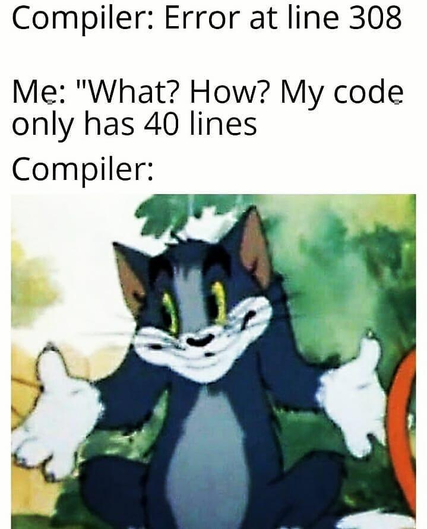

<center>
<h1>
In The Name Of ALLAH
</h1>
<h2>
Advanced Programming - Homework 3
</h2>
<h2>
Dr.Amir Jahanshahi
</h2>
<h3>
Deadline: Friday, 9 Aban - 23:00
</center>


## **Note**: In orther to make this homework more interesting, there may be functions that are not listed below, but you can see them in the gtest file. So you should infere their functionality and prototype from their usage.

#  Introduction
One of the famous data structures to store data is **Binary Search Tree**. As you can guess, it's a tree with some properties. Each node has at most, two children. The left child is always smaller than it and the right child is always larger. This property makes searching so fast in BST compared to an ordinary array. As an example, you can see a BST below.


An interesting point about BST is that, by traversing it **inorder**, you get the data in a sorted manner. Isn't that beautiful?

In this homework you would create a **BST** class so that we can store integers in these data structures. In order to learn how to perform **add**, **remove** and **search** in BST you might find [this](https://www.geeksforgeeks.org/binary-search-tree-set-1-search-and-insertion/) and [this](https://www.geeksforgeeks.org/binary-search-tree-set-2-delete/) links or whatever source you like, useful. There would be a discussion in the TA class too (But we strongly suggest you to start learning it sooner than the class).

#  BST
Implement a **BST** class with the following properties.

```c++
class BST{
private:
    class Node{
        public:
            std::shared_ptr<Node> parent{nullptr};
            std::shared_ptr<Node> right{nullptr};
            std::shared_ptr<Node> left{nullptr};
            int val;
            Node(std::shared_ptr<Node> p, std::shared_ptr<Node> r, std::shared_ptr<Node> l);
            Node(int i);
            void show();  //  Prints the value of a node in a single line
    };   
    std::shared_ptr<Node> proot{nullptr};
public:
    BST(const BST& b);
    int root();  //  Returns the root value
    int operator[](int index);
    size_t size();  //  Returns no of elements in BST 
    BST operator+(int i);  //  Adds i to the BST
    bool search(int i);  //  Returns true if the value i is in BST, otherwise false
    std::vector<int> inorder();  //  Inorder traverse of tree
    std::vector<int> preorder();  //  Preorder traverse of tree
    std::vector<int> postorder();  //  Postorder traverse of tree
    void show();  //  Prints the inorder traverse of BST in a single line.
};
```
You should also have **add**, **remove** and **search** functions. Don't forget to check how they must work in gtests.

**Note**: You can define any function that you think can help you in the **BST** class other than those mentioned above. But you should **not** change any prototype of the above functions or any type of the above variables. You can also define any function out of BSS class, in **aphw3.h** and **aphw3.cpp** files.

# main File
You must not alter the **main.cpp** file at all. Good luck!


